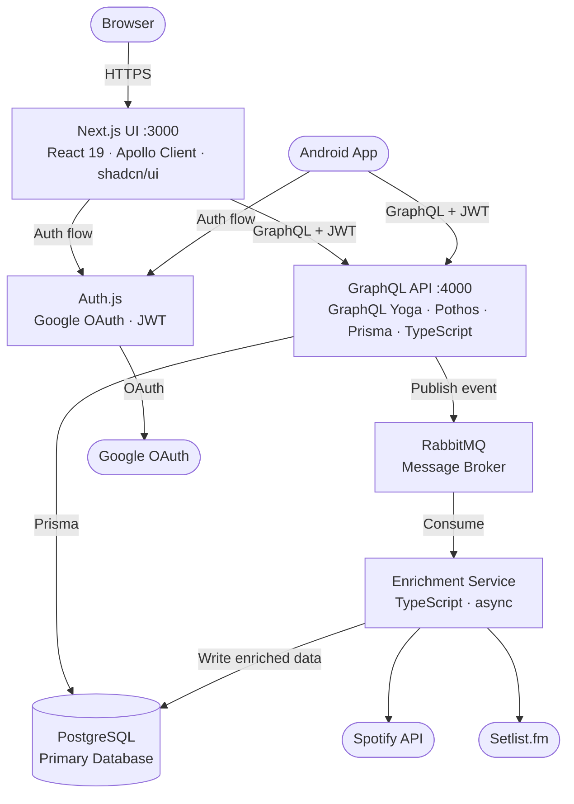
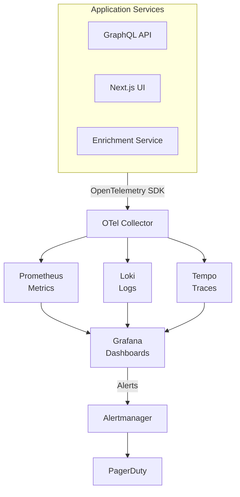
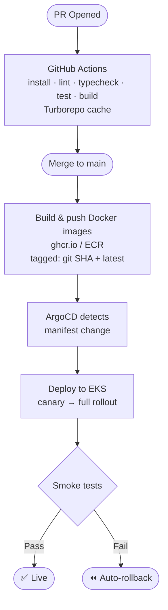

# Architecture Design Document

**Status:** 🟡 In Progress — Module 1 (Containerization & Local Kubernetes)

**Last Updated:** 2026-03-25

**Author:** Jesse Rinehart

## Table of Contents

1. [Overview](#1-overview)
2. [Target Architecture](#2-target-architecture)
3. [Module Roadmap](#3-module-roadmap)
4. [Technology Decisions](#4-technology-decisions)
5. [ADR Log](#5-adr-log)
6. [Stretch Goals](#6-stretch-goals)

> [!NOTE]
> **Current status, active blockers, and in-progress work are tracked separately in [STATUS.md](./STATUS.md).**

## 1. Overview

### What Is This Project?

**The Things I've Seen** is a personal event (concert, sporting event, etc.) tracking and visualization app built around a dataset of ~500 real event attendance records spanning 1995–2024. It started as a simple CRUD app and is being evolved into a fully production-hardened, cloud-deployed platform.

### Why Does It Exist?

This project serves two concurrent purposes:

1. **Personal tool** — A meaningful dataset to query, visualize, and enrich with external data (Spotify artist info, Setlist.fm setlists, mapping).
2. **SRE/DevOps learning vehicle** — A real application used as the test case for systematically learning and implementing production engineering practices: containerization, CI/CD, cloud infrastructure, observability, alerting, chaos engineering, and GitOps.

The project is public and intended to demonstrate end-to-end ownership of a product — from initial architecture through production deployment.

## 2. Target Architecture

### System Overview

The target system consists of three application services, a message broker, a primary database, and a full observability stack — deployed locally on Kubernetes (k3s) and in the cloud on AWS EKS.

### Observability Stack

All services emit telemetry via OpenTelemetry. The Grafana stack provides unified visibility across metrics, logs, and traces.

### Infrastructure Architecture

#### Local Development (Module 1)

- Docker Compose for initial dev workflow
- k3s or Docker Desktop Kubernetes for local Kubernetes practice
- All services running as Kubernetes pods with liveness/readiness probes

#### Cloud Production (Module 3+)

- **Compute:** AWS EKS (Elastic Kubernetes Service)
- **Database:** AWS RDS (PostgreSQL 16)
- **Container Registry:** GitHub Container Registry (ghcr.io) for dev; AWS ECR for production
- **DNS:** AWS Route53
- **Ingress:** nginx-ingress controller via Helm
- **Secrets:** Kubernetes Secrets or AWS Secrets Manager
- **IaC:** Terraform (VPC, subnets, security groups, EKS cluster, RDS)

#### CI/CD Pipeline (Module 2–3)

### Kubernetes Deployment Model

Each service runs as a Kubernetes `Deployment` with:

- Liveness and readiness probes
- CPU and memory requests/limits
- Horizontal pod autoscaling (future)
- ConfigMaps for non-secret configuration
- Secrets for credentials and API keys

| Service            | Replicas (target)          | Notes                              |
| ------------------ | -------------------------- | ---------------------------------- |
| UI (Next.js)       | 2                          | Stateless                          |
| API (GraphQL)      | 2                          | Stateless                          |
| Enrichment Service | 2                          | Stateless, scales with queue depth |
| RabbitMQ           | 1 (dev) / clustered (prod) | Via Helm chart                     |
| PostgreSQL         | Managed (RDS)              | Not in-cluster in production       |

### Data Flow: Event Enrichment

When a new concert event is created:

1. User submits form in the UI
2. Apollo Client sends `addEvent` GraphQL mutation to API
3. API persists the event to PostgreSQL via Prisma
4. API publishes an `event.created` message to RabbitMQ
5. Enrichment Service consumes the message from the queue
6. Enrichment Service queries Spotify API for artist/track data
7. Enrichment Service queries Setlist.fm for setlist data
8. Enrichment Service writes enriched data back to PostgreSQL
9. UI can query enriched event data on next fetch

Failed enrichment attempts are retried via RabbitMQ dead letter queue with exponential backoff.

### SLO Definitions (Module 6 target)

| Service            | SLO                               | Metric                   |
| ------------------ | --------------------------------- | ------------------------ |
| GraphQL API        | 99% of requests < 500ms           | p99 latency              |
| GraphQL API        | Error rate < 1%                   | 5xx responses / total    |
| Enrichment Service | 95% of events enriched within 30s | Queue processing latency |
| Enrichment Service | Dead letter queue depth < 10      | DLQ message count        |

## 3. Module Roadmap

Full acceptance criteria, implementation checklists, and per-module notes live in [`docs/modules/`](./modules/README.md). This table is the high-level overview.

| Module                                            | Focus                                | Status         | Target Outcome                                                           |
| ------------------------------------------------- | ------------------------------------ | -------------- | ------------------------------------------------------------------------ |
| [01](./modules/module-01-containerization.md)     | Containerization & Local Kubernetes  | 🟡 In Progress | Full stack running in local k8s with probes and resource limits          |
| [02](./modules/module-02-cicd.md)                 | Build System & CI/CD Foundation      | ⬜ Not Started | Turborepo build cache, GitHub Actions CI, images published to ghcr.io    |
| [03](./modules/module-03-cloud-infrastructure.md) | Cloud Infrastructure & Terraform     | ⬜ Not Started | EKS cluster + RDS provisioned via Terraform, app accessible at real URL  |
| [04](./modules/module-04-auth.md)                 | Authentication & Authorization       | ⬜ Not Started | Auth.js with Google OAuth, JWT-protected GraphQL API, session management |
| [05](./modules/module-05-service-extraction.md)   | Service Extraction & Message Queue   | ⬜ Not Started | Enrichment service deployed, RabbitMQ running, async flow end-to-end     |
| [06](./modules/module-06-metrics-dashboards.md)   | Observability — Metrics & Dashboards | ⬜ Not Started | Prometheus + Grafana, RED method dashboards per service                  |
| [07](./modules/module-07-logging-tracing.md)      | Observability — Logging & Tracing    | ⬜ Not Started | Loki + Tempo via OTel, SLO compliance dashboards                         |
| [08](./modules/module-08-alerting.md)             | Alerting & Incident Response         | ⬜ Not Started | SLO-based alerts, runbooks, chaos day postmortem                         |
| [09](./modules/module-09-gitops.md)               | GitOps & Advanced Deployment         | ⬜ Not Started | ArgoCD, canary deployments, Terraform in CI, image scanning              |
| [10](./modules/module-10-chaos.md)                | Chaos Engineering & Polish           | ⬜ Not Started | Automated chaos experiments, cost optimization, portfolio polish         |

## 4. Technology Decisions

### Application Stack

| Decision                   | Choice                  | Rationale                                                                                                                                                                              |
| -------------------------- | ----------------------- | -------------------------------------------------------------------------------------------------------------------------------------------------------------------------------------- |
| GraphQL schema builder     | Pothos                  | Native Prisma plugin; more composable than Type-GraphQL; better TypeScript integration                                                                                                 |
| GraphQL server             | GraphQL Yoga            | Lighter than Apollo Server; standards-compliant; better performance                                                                                                                    |
| ORM                        | Prisma                  | Type-safe queries, better DX than Sequelize, native Pothos plugin, migration tooling                                                                                                   |
| Frontend framework         | Next.js 16 (App Router) | Industry standard; SSR/SSG flexibility; strong ecosystem                                                                                                                               |
| Authentication             | Auth.js + Google OAuth  | Free, native Next.js integration, JWT-based sessions; demonstrates SSO without third-party dashboard dependency                                                                        |
| Component library          | shadcn/ui + Radix UI    | Accessible primitives; copy-into-repo model avoids dependency lock-in                                                                                                                  |
| Extracted service language | TypeScript              | Consistent with existing codebase; avoids context-switching overhead. Go is documented as a future rewrite candidate — see [ADR-0008](./adr/0008-typescript-for-enrichment-service.md) |

### Infrastructure & Operations

| Decision            | Choice                        | Rationale                                                                                                                            |
| ------------------- | ----------------------------- | ------------------------------------------------------------------------------------------------------------------------------------ |
| Message broker      | RabbitMQ                      | Proper message broker semantics (exchanges, routing, DLQ, acks); better learning target than Redis pub/sub for async patterns        |
| Tracing backend     | Grafana Tempo + OpenTelemetry | Native Grafana integration enables metric/log/trace correlation in one UI; OTel instrumentation is backend-agnostic and transferable |
| Metrics             | Prometheus + Grafana          | Industry standard; kube-prometheus-stack simplifies Kubernetes deployment                                                            |
| Logging             | Loki + Promtail               | Grafana-native; LogQL is familiar if you know PromQL; lightweight vs. ELK                                                            |
| Cloud platform      | AWS                           | Broadest SRE job market relevance; EKS for managed Kubernetes                                                                        |
| IaC                 | Terraform                     | Industry standard for cloud provisioning; provider-agnostic; aligns with AWS Solutions Architect cert study                          |
| CI/CD               | GitHub Actions                | Native to existing GitHub repo; no additional tooling required                                                                       |
| GitOps              | ArgoCD                        | CNCF graduated; declarative; pairs cleanly with Kubernetes manifests                                                                 |
| Build orchestration | Turborepo                     | Monorepo-aware build caching; reduces CI time as package count grows                                                                 |
| Container registry  | ghcr.io (dev) → ECR (prod)    | GitHub-native for development; ECR integrates with EKS IAM for production                                                            |

## 5. ADR Log

Architecture Decision Records are maintained as individual files in [`docs/adr/`](./adr/README.md). Each ADR captures the context, decision, and consequences at the time it was made. Records are append-only — past decisions are not edited, but may be superseded by new ones.

## 6. Stretch Goals

The following are explicitly out of scope for the current 9-module roadmap but are documented here as intended future work.

### Stats & Insights Service

A service that computes aggregate analytics on the concert dataset on demand or on a schedule:

- Shows per year, per venue, per genre
- Artist frequency, geographic distribution
- Decade-over-decade listening trends

This would be implemented as a TypeScript service, potentially exposed as a dedicated GraphQL endpoint or REST API, and would be a natural candidate for data visualization on the UI.

### Enrichment Service Rewrite in Go

Once the Enrichment Service is stable and well-understood, rewriting it in Go is a natural next step for learning SRE tooling practices. The service boundary and message contract will be fully defined by that point, making it a clean language-swap exercise without architectural risk.

### Performer / Artist Model

The data model has a placeholder for performer/artist tracking that has not yet been implemented. Once enrichment data from Spotify is flowing, a `Performer` model with a many-to-many relationship to `Event` would enable artist-centric queries and visualizations.

### Google Maps Integration

Venue records include `lat`, `lng`, and `placeId` fields already in the schema. A map view showing concert locations over time is a natural UI feature once the geolocation data is populated.

### Android Mobile App (React Native + Expo)

A companion Android app that connects to the same GraphQL API as the web UI, living in the monorepo as `packages/mobile`. This demonstrates how a monorepo can serve multiple platforms (web + mobile) sharing TypeScript types, GraphQL queries, and authentication against a single backend. Built with React Native and Expo to minimize native toolchain overhead. Depends on Module 04 (Authentication) being complete so both clients authenticate via the same Auth.js / Google OAuth flow with shared JWT verification on the API.

### Kafka Migration (at scale)

RabbitMQ is the right choice for the current scale. If the event volume or consumer complexity ever grows to warrant it, migrating to Kafka would be the appropriate evolution. This is not anticipated for this project but is documented for completeness.

_This document is maintained alongside the codebase. For questions or deviations from this plan, open a GitHub issue or append a new ADR to [`docs/adr/`]()._
