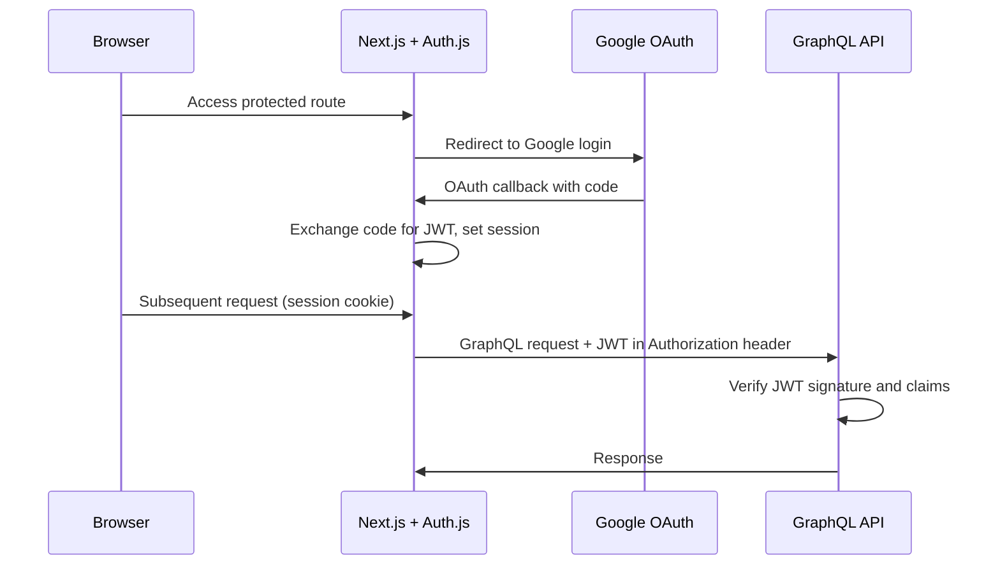

# Module 04: Authentication & Authorization

**Status:** ⬜ Not Started

**Start Date:** —

**End Date:** —

## Goal

Add authentication and authorization to the application using Auth.js (formerly NextAuth.js) with Google OAuth as the identity provider. The UI requires login before access, and the GraphQL API validates JWT tokens on every request. This module establishes the auth contract that all current and future clients (web, mobile) authenticate against.

## Architecture

Auth.js runs inside the Next.js UI as a server-side auth handler. On login, the user authenticates via Google OAuth and receives a signed JWT. The UI attaches this token to all outgoing GraphQL requests. The API validates the JWT signature and extracts the user identity before processing any resolver.

## Acceptance Criteria

- [ ] Auth.js configured in the Next.js app with Google OAuth provider
- [ ] Unauthenticated users are redirected to a login page
- [ ] Authenticated users receive a signed JWT stored in a secure session
- [ ] The GraphQL API validates the JWT on every incoming request
- [ ] Unauthenticated API requests return a 401 response
- [ ] The GraphQL playground remains accessible in development (bypass or dev token)
- [ ] Environment variables for OAuth client ID/secret are documented and managed via Kubernetes Secrets
- [ ] Auth works locally via Docker Compose and in the Kubernetes deployment from Module 01/03

## Implementation Checklist

### UI (Auth.js Setup)

- [ ] Install `next-auth` (Auth.js) package
- [ ] Create Auth.js route handler (`app/api/auth/[...nextauth]/route.ts`)
- [ ] Configure Google OAuth provider with client ID and secret
- [ ] Set `NEXTAUTH_SECRET` for JWT signing
- [ ] Add session provider to the app layout
- [ ] Create a login page
- [ ] Add middleware to protect all routes except `/login` and `/api/auth/*`
- [ ] Attach JWT to Apollo Client's outgoing request headers

### API (JWT Validation)

- [ ] Add JWT verification library (e.g., `jose`)
- [ ] Create auth middleware/plugin for GraphQL Yoga
- [ ] Extract and validate the `Authorization: Bearer <token>` header
- [ ] Expose the authenticated user identity on the GraphQL context
- [ ] Return 401 for missing or invalid tokens
- [ ] Add a development bypass or static dev token for local playground use

### Infrastructure

- [ ] Register a Google OAuth application in Google Cloud Console
- [ ] Add OAuth client ID, client secret, and NextAuth secret to `.env` and Kubernetes Secrets
- [ ] Update Docker Compose to pass auth-related environment variables
- [ ] Update Kubernetes manifests to include auth secrets

## Notes

_No notes yet — this module has not been started._
