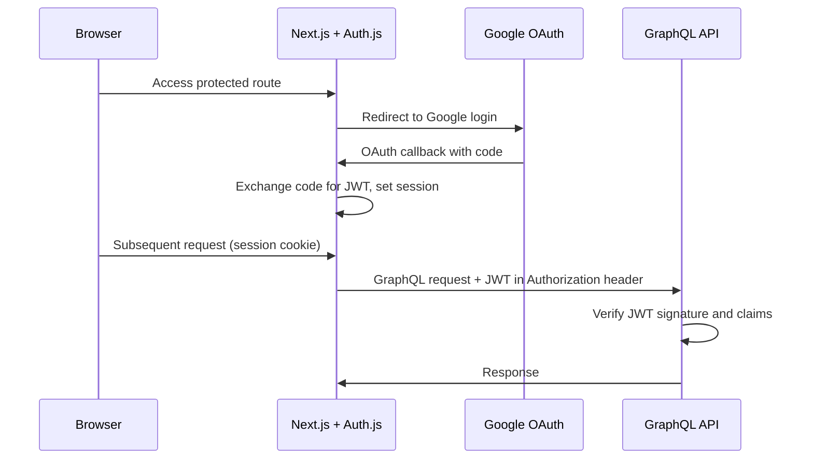

# Module 04: Authentication & Authorization

**Status:** ⬜ Not Started

**Start Date:** —

**End Date:** —

## Goal

Add authentication and authorization to the application using Auth.js (formerly NextAuth.js) with Google OAuth as the identity provider. The UI requires login before access, and the GraphQL API validates JWT tokens on every request. This module establishes the auth contract that all current and future clients (web, mobile) authenticate against.

This module is also where the app first becomes **publicly reachable** on the internet. Route53 DNS, nginx-ingress, and TLS termination land here, in front of the now-authenticated API. Public exposure was deliberately deferred from Module 03 so it coincides with auth — see Module 03's 2026-04-22 "Scope reorder" Notes entry for the reasoning.

## Architecture

Auth.js runs inside the Next.js UI as a server-side auth handler. On login, the user authenticates via Google OAuth and receives a signed JWT. The UI attaches this token to all outgoing GraphQL requests. The API validates the JWT signature and extracts the user identity before processing any resolver.

## Acceptance Criteria

- [ ] Auth.js configured in the Next.js app with Google OAuth provider
- [ ] Unauthenticated users are redirected to a login page
- [ ] Authenticated users receive a signed JWT stored in a secure session
- [ ] The GraphQL API validates the JWT on every incoming request
- [ ] Unauthenticated API requests return a 401 response
- [ ] The GraphQL playground remains accessible in development (bypass or dev token)
- [ ] Environment variables for OAuth client ID/secret are documented and managed via Kubernetes Secrets
- [ ] Auth works locally via Docker Compose and in the Kubernetes deployment from Module 01/03
- [ ] App is publicly reachable at a stable URL with TLS termination (first public exposure — gated by auth from this module)
- [ ] GraphQL API has production hardening in place: restricted CORS, introspection disabled in prod, query depth/complexity limits, safe error responses

## Implementation Checklist

### UI (Auth.js Setup)

- [ ] Install `next-auth` (Auth.js) package
- [ ] Create Auth.js route handler (`app/api/auth/[...nextauth]/route.ts`)
- [ ] Configure Google OAuth provider with client ID and secret
- [ ] Set `NEXTAUTH_SECRET` for JWT signing
- [ ] Add session provider to the app layout
- [ ] Create a login page
- [ ] Add middleware to protect all routes except `/login` and `/api/auth/*`
- [ ] Attach JWT to Apollo Client's outgoing request headers

### API (JWT Validation)

- [ ] Add JWT verification library (e.g., `jose`)
- [ ] Create auth middleware/plugin for GraphQL Yoga
- [ ] Extract and validate the `Authorization: Bearer <token>` header
- [ ] Expose the authenticated user identity on the GraphQL context
- [ ] Return 401 for missing or invalid tokens
- [ ] Add a development bypass or static dev token for local playground use

### Infrastructure

- [ ] Register a Google OAuth application in Google Cloud Console
- [ ] Add OAuth client ID, client secret, and NextAuth secret to `.env` and Kubernetes Secrets
- [ ] Update Docker Compose to pass auth-related environment variables
- [ ] Update Kubernetes manifests to include auth secrets

### Networking & DNS

_Moved from Module 03 so public exposure coincides with auth landing._

- [ ] Set up Route53 domain (or use a free subdomain)
- [ ] Install nginx-ingress controller via Helm
- [ ] Configure ingress rules for all services
- [ ] Verify app is accessible via a real URL

### Pre-Exposure API Hardening

_Concerns whose only reason to exist is the app becoming publicly reachable. Must land before or in the same deploy as the public ingress above._

- [ ] Configure CORS in GraphQL Yoga — restrict `origin` to the UI domain(s), not `*`
- [ ] Disable GraphQL introspection in production (keep enabled in dev for GraphiQL)
- [ ] Add query depth limit (e.g., via `@escape.tech/graphql-armor-max-depth` or `@envelop/depth-limit`)
- [ ] Add query complexity/cost limit
- [ ] Structured error handling — suppress Prisma internals and stack traces in production responses; log full detail server-side only

## Notes

### 2026-04-22 — Scope injection from Module 03 security review

- The "Networking & DNS" and "Pre-Exposure API Hardening" sections above were added before this module began. They originated during Module 03 Phase 3b planning, when a security review found the app had no authentication, no CORS, no query limits, and introspection enabled — and Module 03's original scope would have put all of that on the public internet before Module 04 landed.
- See Module 03's 2026-04-22 "Scope reorder" Notes entry for the full reasoning and the alternatives considered (infra-layer auth stopgaps like basic auth, Cloudflare Access, or IP allowlists — all rejected as throwaway work).
- Practical consequence for this module: the Networking & DNS work should happen _after_ auth enforcement is live in the API, and the Pre-Exposure API Hardening items should land in the same deploy as the ingress — not before and not after.
