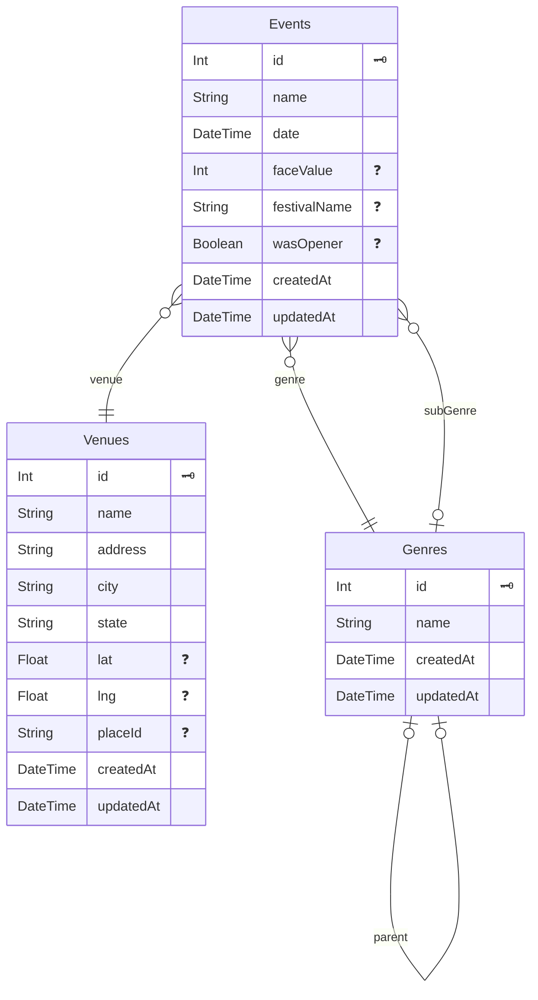

```mermaid
erDiagram

  "Venues" {
    Int id "🗝️"
    String name
    String address
    String city
    String state
    Float lat "❓"
    Float lng "❓"
    String placeId "❓"
    DateTime createdAt
    DateTime updatedAt
    }


  "Events" {
    Int id "🗝️"
    String name
    DateTime date
    Int faceValue "❓"
    String festivalName "❓"
    Boolean wasOpener "❓"
    DateTime createdAt
    DateTime updatedAt
    }


  "Genres" {
    Int id "🗝️"
    String name
    DateTime createdAt
    DateTime updatedAt
    }

    "Events" }o--|| Venues : "venue"
    "Events" }o--|| Genres : "genre"
    "Events" }o--|o Genres : "subGenre"
    "Genres" |o--|o Genres : "parent"
```
